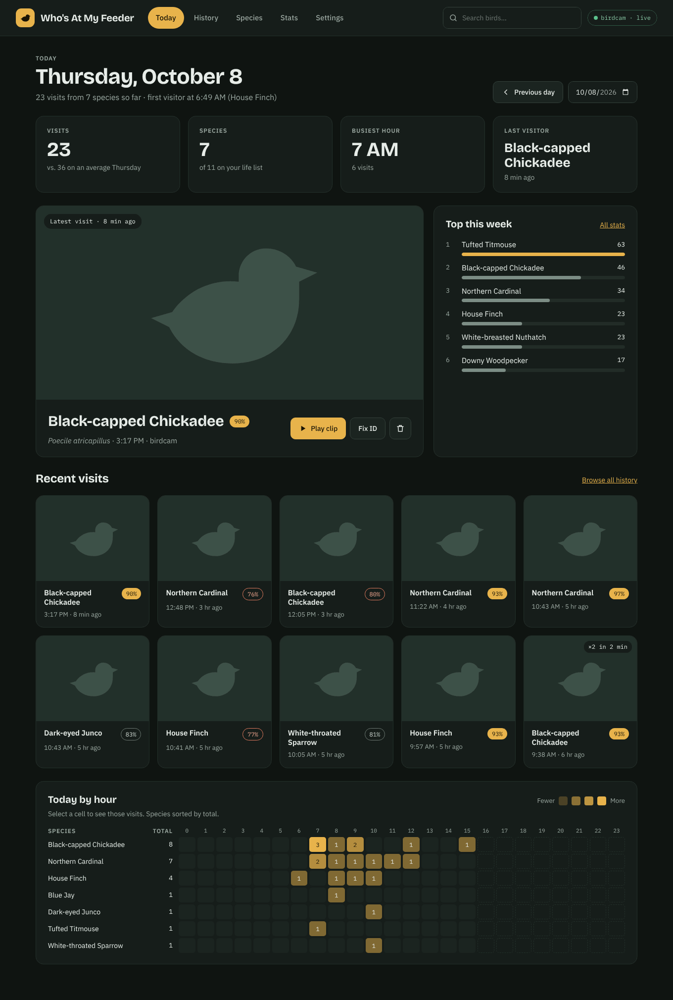
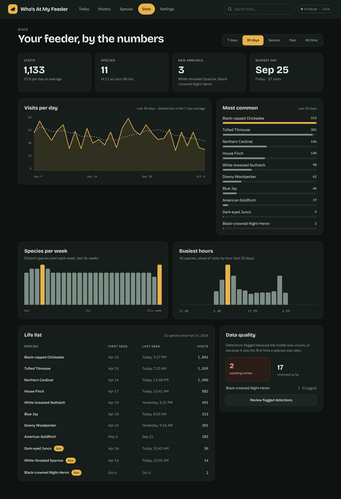
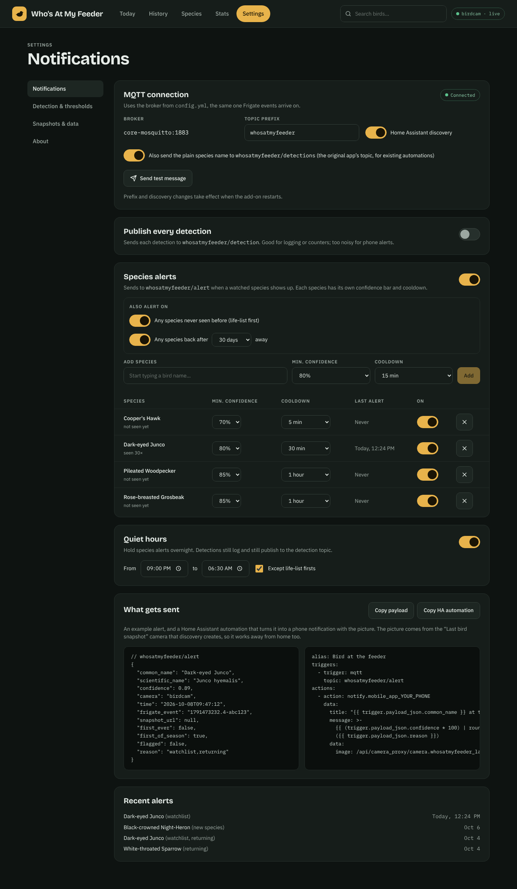
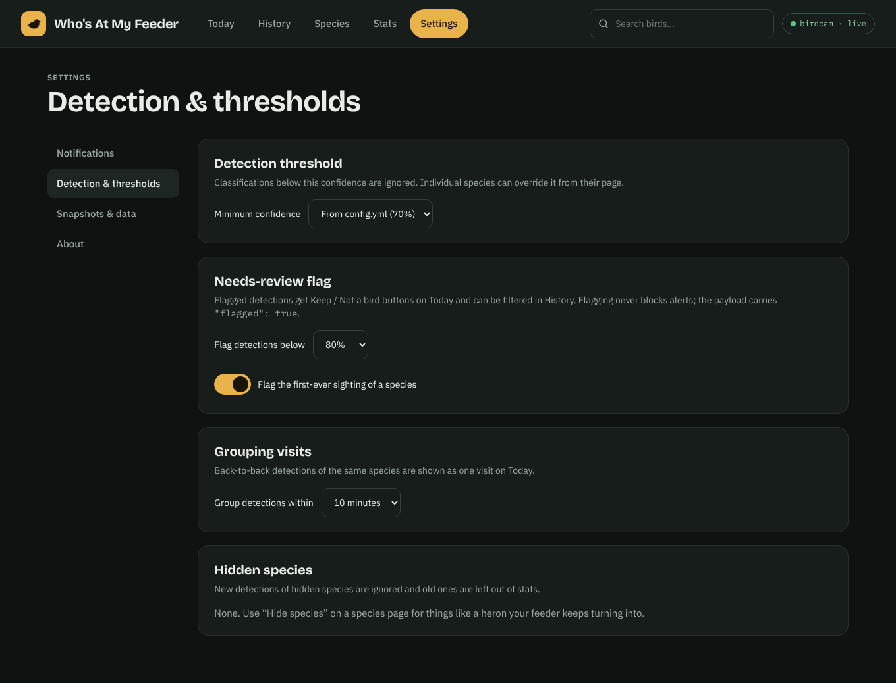
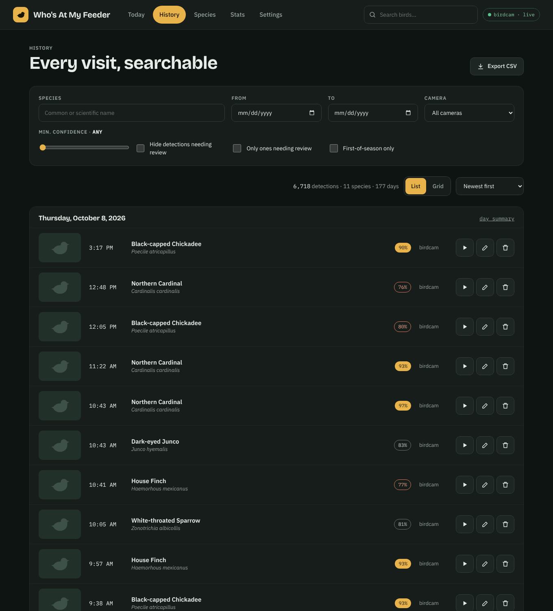
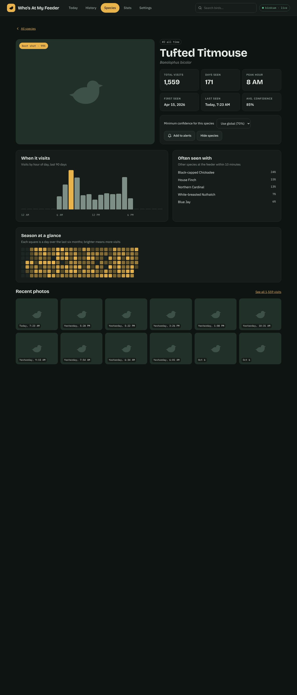
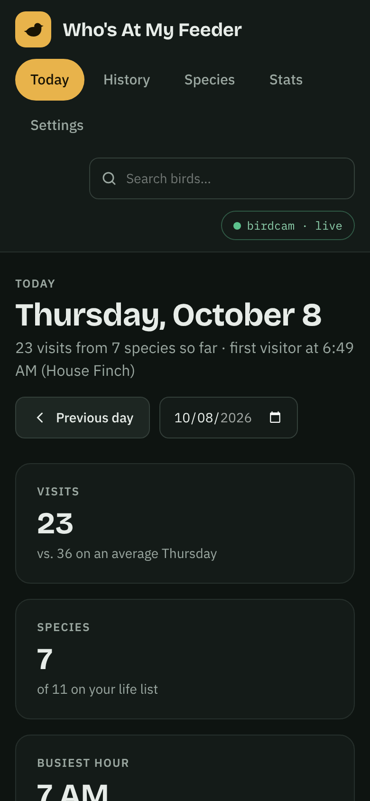

# Who's At My Feeder?
## Version 2.0

WARNING/NOTE: This 2.0 fork is heavily vibe-coded, but working well for me. It was used to improve the interface and add MQTT alerting, as well as more customization and options. More details below. 

This fork adds a new interface and alerting on top of the original detector:

* **Today**: latest visit, recent visits grouped by species, and an hour-by-hour heatmap.
* **History**: search by species, date, camera, confidence or hour; list/grid views; CSV export.
* **Species pages**: best shot, first/last seen, visiting hours, a six-month calendar, birds it's seen with.
* **Stats**: visits over time, most common species, species per week, life list.
* **MQTT alerts**: a watchlist with per-species confidence and cooldown, life-list firsts,
  returning species and quiet hours, plus Home Assistant discovery (Last bird sensor and snapshot camera).
* **Data quality**: low-confidence and first-time detections are flagged for review; fix an ID,
  delete it, or hide a species entirely.
* **Snapshots are kept** locally, so pictures survive Frigate's retention.
* Works behind Home Assistant ingress. Existing `speciesid.db` files upgrade automatically.

### Screenshots

*Taken with sample data. Gray bird tiles are the placeholder shown when a picture isn't available.*

**Today**: latest visit, today's numbers, recent visits grouped by species, and an hour-by-hour heatmap.



**Stats**: visits over time with a 7-day average, most common species, species per week, busiest hours, the life list, and items waiting for review.



**Settings → Notifications**: MQTT alerts with a per-species watchlist, life-list firsts, returning species, quiet hours, and a ready-to-paste Home Assistant automation.



**Settings → Detection & thresholds**: global confidence threshold, review flags, visit grouping, and hidden species.



<details>
<summary>More: history search, species page, phone layout</summary>

**History**



**Species page**



**On a phone**



</details>

### Home Assistant add-on

Add this repository in **Settings → Add-ons → Add-on Store → ⋮ → Repositories**:
`https://github.com/rw377/WhosAtMyFeeder`, then install **Who's At My Feeder - Fork**.
See [whosatmyfeeder/DOCS.md](whosatmyfeeder/DOCS.md) for options and for moving data over from the original add-on.

### Docker

Same as before (below), except the sample config is now `config/config.example.yml`: copy it to
`config/config.yml` and edit. An optional `mqtt_port` setting is supported under `frigate:`.

This app acts as sidecar to [Frigate](https://frigate.video/) to identify the species of
the birds that Frigate detects. It is using the bird species classifier model found here: https://tfhub.dev/google/lite-model/aiy/vision/classifier/birds_V1/3

**Prequisites**

1. A working & Accessible Frigate Installation with at least 1 Camera configured
2. A MQTT Broker that Frigate successfully connects to
3. Configuration of the camera(s) in Frigate to DETECT and SNAPSHOT the 'bird' OBJECT

*Frigate Config*

As a prerequisite of running this project, you must set up Frigate to detect the ['bird' object](https://docs.frigate.video/configuration/objects) in a video stream, and
to send out [snapshots](https://docs.frigate.video/configuration/snapshots). This also assumes you have setup a MQTT broker, like [Mosquitto MQTT](https://github.com/eclipse/mosquitto)

*Example Frigate Config Needed 
(This is purely for reference. This config assumes you have a CORAL TPU USB and Intel IGPU using VAAPI and most likely will not work if you copy and paste. Please tune it to your Frigate & MQTT configuration. See the full Frigate configuration file documentation [here](https://docs.frigate.video/configuration/))*

```
mqtt:
  host: 192.168.1.100
  port: 1883
  topic_prefix: frigate
  user: mqtt_username_here
  password: mqtt_password_here
  stats_interval: 60
detectors:
  coral:
    type: edgetpu
    device: usb
ffmpeg:
  global_args: -hide_banner -loglevel warning
  hwaccel_args: preset-vaapi
  input_args: preset-rtsp-generic
  output_args:
    # Optional: output args for detect streams (default: shown below)
    detect: -threads 2 -f rawvideo -pix_fmt yuv420p
    # Optional: output args for record streams (default: shown below)
    record: preset-record-generic
detect:
  width: 1920
  height: 1080
objects:
  track:
    - bird
snapshots:
  enabled: true
cameras:
  birdcam:
    record:
        enabled: True
        events:
          pre_capture: 5
          post_capture: 5
          objects:
            - bird
    ffmpeg:
      hwaccel_args: preset-vaapi
      inputs:
        - path: rtsp://192.168.1.101:8554/cam
          roles:
            - detect
            - record
    mqtt:
      enabled: True
      bounding_box: False #this will get rid of the box around the bird. We already know it is a bird. Sheesh.
      timestamp: False #this will get rid of the time stamp in the image. 
      quality: 95 #default quality is 70, which will get you lots of compression artifacts
      
```

*Docker Config*

Then, on the machine where you want to run this app, create a new directory. Copy
the docker-compose.yml file from here into that directory. Take a quick peek
at that file and make any changes that might be needed, like the timezone.

In your directory, make a directory called config, and copy config/config.example.yml from this repo to config/config.yml
into your config directory. Edit the file to make changes for your setup. You can add the names
of multiple cameras to the camera array. The model is already
in the image, so unless you want to use a different model, no need to change the
model name.

Finally, make a directory called data. The database will be created there.

Your directory structure should now look something like this before starting the container:
* /whosatmyfeeder
    * docker-compose.yml
    * /data/
    * /config/
        * config.yml

**Running the container**

Once you have completed the above, fire it up with `docker-compose up -d` 
If you used the default config file and default docker-compose file you should be able to access the web UI at: 
http://127.0.0.1:7766 or on http://yourserveraddress:7766

**Docker Image**
The image is on Docker Hub at https://hub.docker.com/r/mmcc73/whosatmyfeeder
